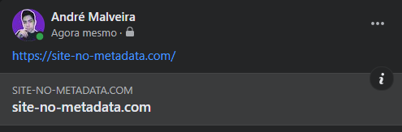
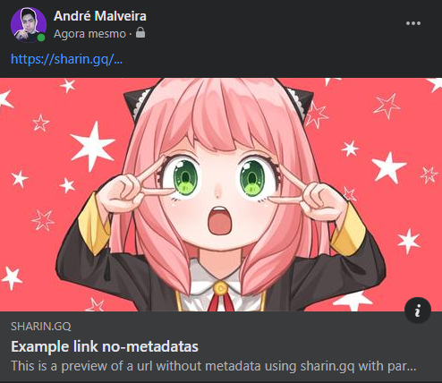

<p align="center">
  
</p>


## Sharin.gq

### Custom preview link to share

At one point I needed to share a url, but this url had no metadata on its page, and as we know a good share is when it shows the metadata of that url, such as a title, description, image and site name.

Because of that I created this free tool in which you can add a url with title, description and image and share it with a preview of this information.

## How to use

> ### Base URL
```js
https://sharin.gq?
```

> ### Parameters
| Parameters   | Alias  | Property                 | Description |
| ------------ | ------ | ------------------------ | ---------------------------|
| url=         | u=     | og:url                   | URL/Link you want to share
| title=       | t=     | og / twitter:title       | Preview title
| description= | d=     | og / twitter:description | Description of preview
| image=       | i=     | og / twitter:image       | Preview Image URL/Link
| site_name=   | sn=    | og:site_name             | Site name or URL name

<br/>

> ### Example
> - See that this url `https://site-no-metadata.com/` when trying to share it doesn't show metadata view, that's because this link doesn't have it.

<p align="center">
  
</p>

> - I added a random image link one, title and description per parameter.
> - Creating a url with Sharin, this would be the result:
```jsx
https://sharin.gq?u=https://site-no-metadata.com/&t=Example%20link%20no-metadatas&d=This%20is%20a%20preview%20of%20a%20url%20without %20metadata%20using%20sharin.gq%20with%20parameters&i=https%3A%2F%2Fimages4.alphacoders.com%2F118%2Fthumb-1920-1187146.jpg
```

<p align="center">
  
</p>


<br/>
<br/>

<p align="center"> Developed by <a href="https://github.com/andremalveira">@andremalveira </a></p>